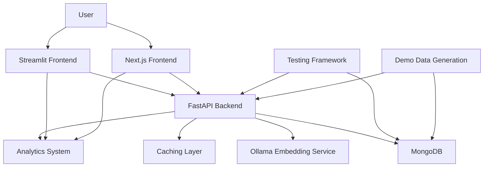
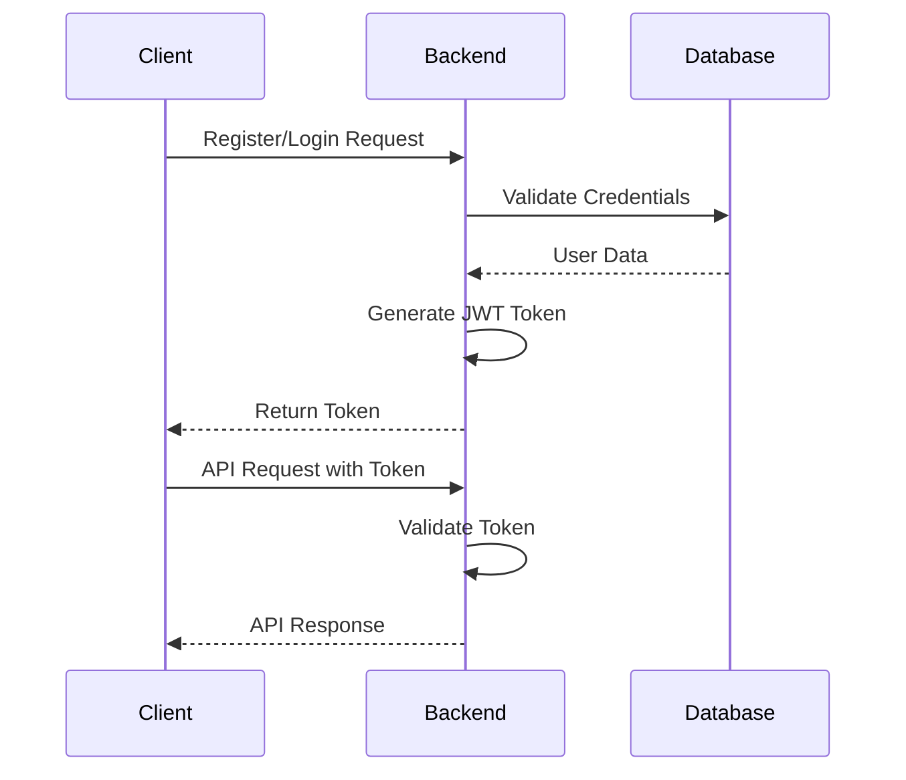
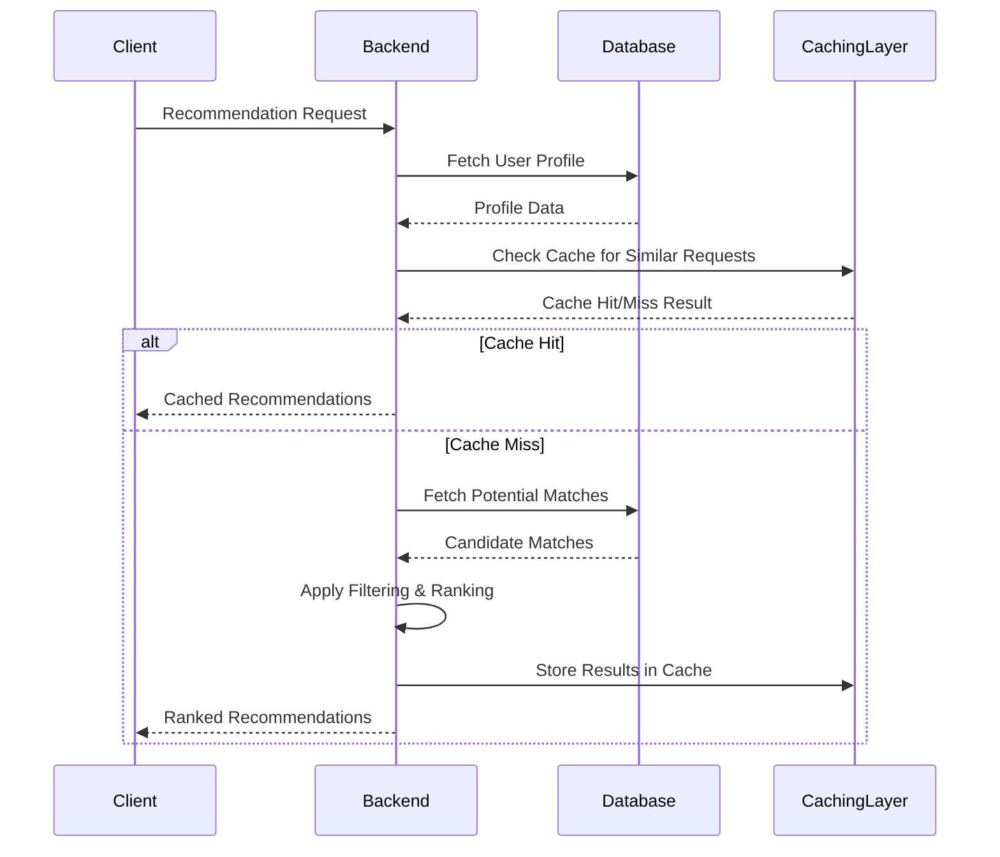
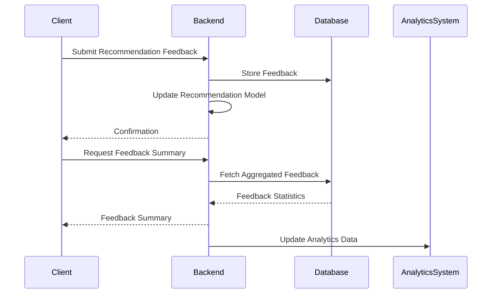
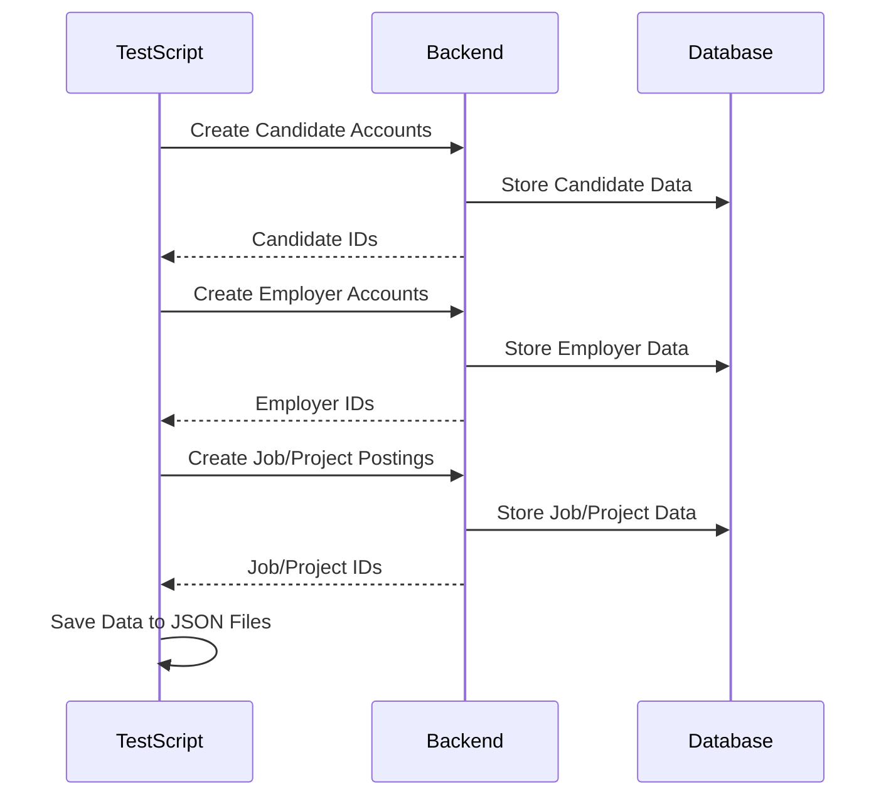
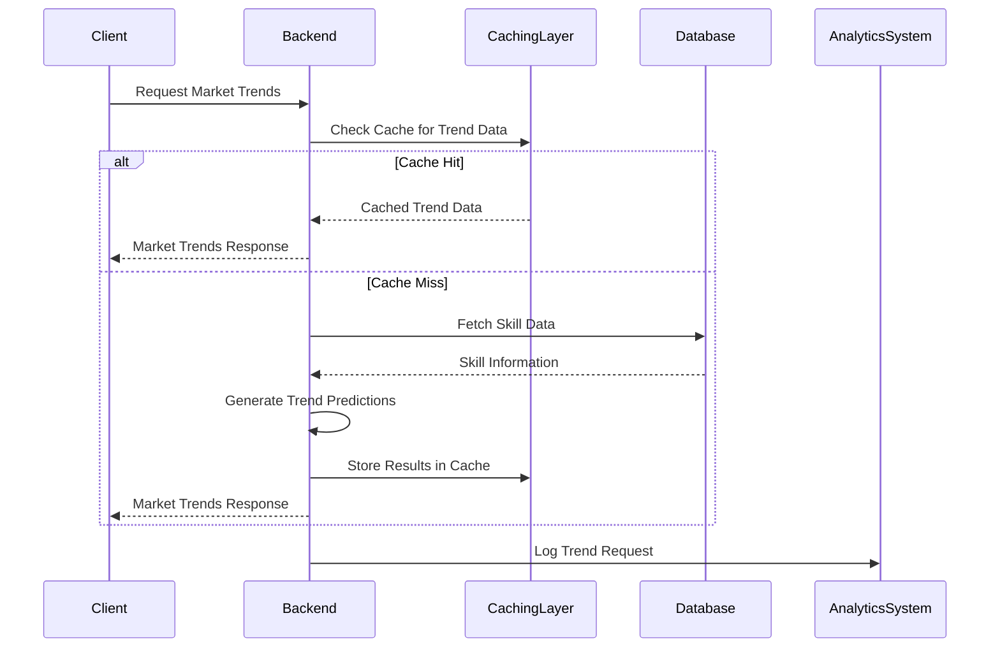
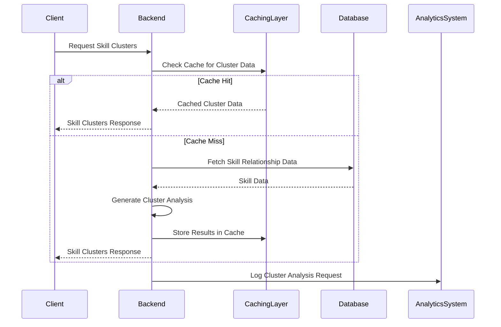
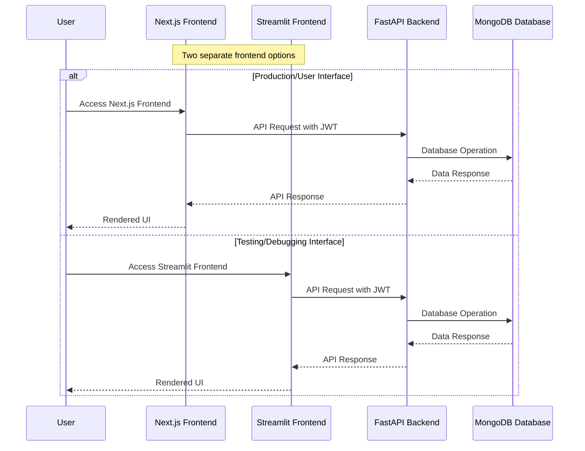
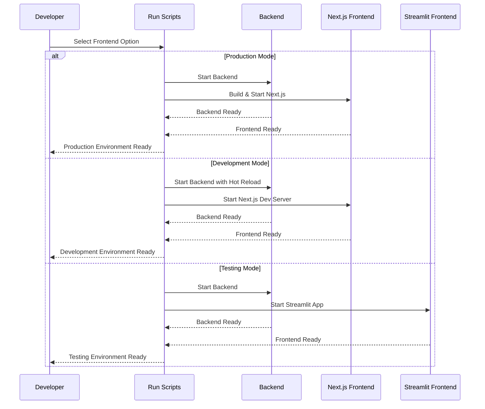

# System Patterns

## Architecture Overview

The Job Recommendation System follows a microservices architecture with the following components:

1. **FastAPI Backend**: RESTful API endpoints for all functionality
2. **Dual Frontend**:
   - **Streamlit Frontend**: Testing interface for debugging and API validation
   - **Next.js Frontend**: Production user interface with enhanced features
3. **MongoDB Database**: Data storage for profiles, jobs, and recommendations
4. **Ollama Embedding Service**: Vector embedding generation for semantic matching
5. **Testing Framework**: Comprehensive testing tools for verification
6. **Caching Layer**: Performance optimization for frequently accessed data
7. **Analytics System**: Data collection and visualization for insights

## Component Relationships

## Key Design Patterns

### API Design Patterns
- RESTful endpoint structure
- JWT authentication for security
- Pydantic models for request/response validation
- Consistent error handling
- Versioned endpoints where needed
- Comprehensive documentation
- Structured response formatting
- Detailed error messages
- Backward compatibility support

### Data Access Patterns
- Repository pattern for database access
- Data Transfer Objects (DTOs) for API responses
- Vector embeddings for semantic search
- Indexing for performance optimization
- Caching for frequently accessed data
- Query optimization for efficiency

### Recommendation Patterns
- Vector similarity for matching
- Hybrid filtering approach
- Feedback-based improvement
- Confidence scoring
- Match factor analysis
- Skill clustering for relationship understanding
- Market trend prediction for forward-looking insights

### Testing Patterns
- Unit tests for core functionality
- Integration tests for API endpoints
- Visual demonstration for workflow verification
- Demo data generation for realistic testing
- Comprehensive test reporting
- Performance testing for critical endpoints
- A/B testing for algorithm comparison

### Performance Optimization Patterns
- In-memory caching for frequent data
- Database query optimization
- Vector search optimization
- Response time monitoring
- Cache invalidation strategies
- Efficient data structures

## Core System Flows

### Authentication Flow

### Recommendation Flow

### Feedback Collection Flow

### Demo Data Generation Flow

### Market Trends Analysis Flow

### Skill Clusters Analysis Flow

## Module Structure

### Backend Modules
- **auth**: Authentication and authorization
- **models**: Data models and schemas
- **routes**: API endpoints
- **services**: Business logic
- **utils**: Utility functions
- **db**: Database access
- **ml**: Machine learning components
- **analytics**: Data collection and analysis
- **cache**: Caching mechanisms

### Frontend Modules
- **pages**: Multi-page application structure
- **components**: Reusable UI components
- **utils**: Frontend utility functions
- **api**: API client functions
- **visualizations**: Data visualization components

### Testing Modules
- **tests**: Test scripts and utilities
- **workflow_functions**: Helper functions for workflow testing
- **test_suite**: Organized test cases
- **demo_data**: Demo data generation scripts
- **performance_tests**: Performance testing utilities

## Frontend Integration Flow

### Dual Frontend Architecture

### Frontend Selection Flow

### Frontend Module Integration
- **Next.js Frontend**: Modern production UI with enhanced features
  - TypeScript and React components
  - Client-side state management
  - Server-side rendering capabilities
  - Optimized for production use

- **Streamlit Frontend**: Testing and debugging interface
  - Python-based interactive components
  - Quick prototyping capabilities
  - Direct API interaction visualization
  - Simplified state management

Both frontends use the same API endpoints, authentication methods, and data structures, ensuring consistency across interfaces while serving different purposes in the development lifecycle.

## Data Models

### User Model
- Basic information (name, email, etc.)
- Authentication details
- Profile type (candidate/employer)
- Preferences and settings

### Candidate Profile
- Skills with proficiency levels
- Work experience
- Education history
- Availability
- Remote work preferences
- Career goals

### Employer Profile
- Company information
- Industry
- Size
- Location
- Contact details

### Job Posting
- Requirements
- Responsibilities
- Compensation
- Location
- Remote work options
- Skills needed

### Project Posting
- Requirements
- Duration
- Budget
- Skills needed
- Availability requirements

### Recommendation
- Match score
- Match factors
- Relevance metrics
- Action tracking

### Feedback
- Recommendation ID
- User ID
- Relevance score
- Accuracy score
- Action taken
- Comments

### Market Trend
- Skill ID
- Timeframe
- Current demand score
- Projected demand score
- Growth rate
- Confidence score
- Salary projections
- Industry relevance
- Complementary skills

### Skill Cluster
- Core skills
- Related skills
- Confidence scores
- Industry relevance
- Growth rates
- Market demand

## Testing Patterns

### API Testing
- Endpoint validation
- Authentication verification
- Response format checking
- Error handling validation
- Performance measurement
- Response time monitoring

### Visual Demonstration
- Workflow verification
- UI interaction testing
- End-to-end process validation
- Screenshot capture

### Demo Data Generation
- Realistic profile creation
- Varied data characteristics
- Edge case coverage
- Volume testing
- Data persistence

### Test Reporting
- Success/failure tracking
- Performance metrics
- Coverage analysis
- Issue identification

### Performance Testing
- Response time measurement
- Resource usage monitoring
- Scalability testing
- Caching effectiveness validation

## System Interactions

### User Registration
1. User submits registration form
2. System validates input
3. System creates user account
4. System generates authentication token
5. User receives confirmation

### Profile Creation
1. User submits profile information
2. System validates input
3. System creates profile
4. System generates embeddings
5. Profile is ready for matching

### Job Posting
1. Employer creates job posting
2. System validates input
3. System creates job posting
4. System generates embeddings
5. Job is ready for matching

### Recommendation Generation
1. User requests recommendations
2. System checks cache for similar requests
3. If cache hit, return cached results
4. If cache miss, retrieve user profile
5. System finds potential matches
6. System applies filters and ranking
7. System caches results for future requests
8. System returns ranked recommendations

### Feedback Collection
1. User provides feedback on recommendation
2. System stores feedback
3. System updates recommendation model
4. System updates analytics data
5. Future recommendations are improved

### Demo Data Creation
1. Test script generates realistic user data
2. System creates accounts through API
3. Test script generates job/project data
4. System creates postings through API
5. Test data is saved for reference

### Market Trends Analysis
1. User requests market trends for skills
2. System checks cache for trend data
3. If cache hit, return cached results
4. If cache miss, retrieve skill data
5. System generates trend predictions
6. System caches results for future requests
7. System returns trend analysis
8. System logs request in analytics

### Skill Clusters Analysis
1. User requests skill clusters
2. System checks cache for cluster data
3. If cache hit, return cached results
4. If cache miss, retrieve skill relationship data
5. System generates cluster analysis
6. System caches results for future requests
7. System returns cluster analysis
8. System logs request in analytics

## Design Decisions

### Authentication
- JWT tokens for stateless authentication
- Refresh token mechanism for extended sessions
- Role-based access control

### Database
- MongoDB for flexible schema
- Indexes for query optimization
- Vector storage for embeddings

### API
- RESTful design for clarity
- Comprehensive documentation
- Consistent response format
- Detailed error messages
- Backward compatibility support

### Testing
- Comprehensive test coverage
- Visual demonstration for workflow verification
- Demo data generation for realistic testing
- Automated test execution
- Performance monitoring

### Performance Optimization
- Caching strategy for frequent data
- Vector search optimization
- Database query efficiency
- Response time monitoring
- Resource usage optimization

## Patterns for Extension

### Adding New Recommendation Types
1. Create new endpoint in recommendation routes
2. Implement matching algorithm in service layer
3. Add frontend component for display
4. Create test cases for validation
5. Implement caching for performance

### Adding New Profile Fields
1. Update user model schema
2. Add migration for existing data
3. Update profile forms in frontend
4. Update matching algorithms if needed
5. Update caching mechanisms if necessary

### Adding New Testing Capabilities
1. Create new test script in tests directory
2. Implement test cases and assertions
3. Add to test suite for automated execution
4. Document testing approach
5. Add performance metrics collection

### Adding New Demo Data Types
1. Create new generation script
2. Define realistic data patterns
3. Implement API calls for data creation
4. Add JSON storage for reference
5. Include diverse test scenarios

### Adding New Analytics Features
1. Define data collection requirements
2. Create data storage mechanism
3. Implement aggregation queries
4. Create visualization components
5. Add data refresh mechanisms

## Performance Optimization Patterns

### Caching Strategy
- In-memory caching for frequent data
- Time-based cache invalidation
- Event-based cache invalidation
- Partial result caching
- Query-specific caching

### Vector Search Optimization
- Efficient embedding comparison
- Dimensionality reduction where appropriate
- Pre-filtering to reduce search space
- Approximate nearest neighbor search
- Database index optimization

### Query Optimization
- Proper index utilization
- Projection to return only needed fields
- Efficient aggregation pipelines
- Batch processing for large operations
- Connection pooling for stability

### Response Time Monitoring
- Endpoint performance tracking
- Slow query identification
- Resource usage monitoring
- Bottleneck detection
- Performance trend analysis

## Notes
- Maintain separation of concerns
- Follow RESTful API design principles
- Ensure comprehensive testing
- Document all endpoints and models
- Focus on modular, extensible design
- Prioritize performance for vector operations
- Consider scalability in database design
- Implement proper error handling
- Provide detailed feedback on matches
- Use realistic demo data for testing 
- Implement effective caching for performance
- Optimize vector operations for response time
- Collect analytics data for system improvement
- Monitor performance for critical endpoints 