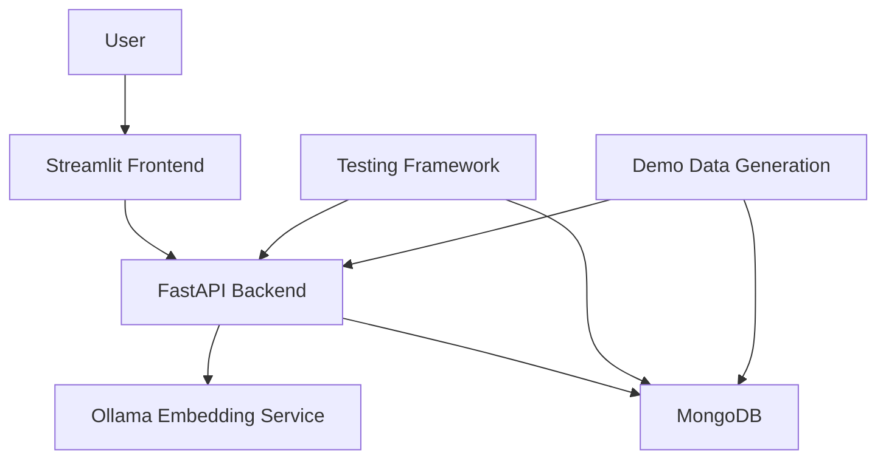
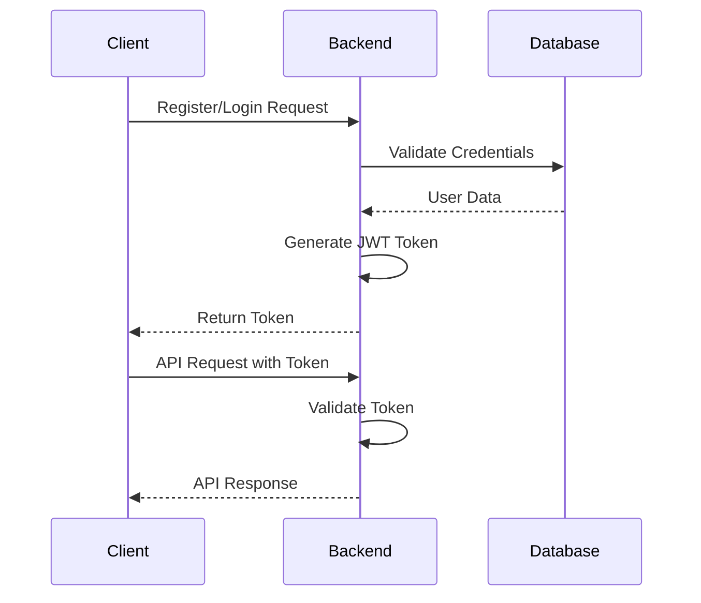
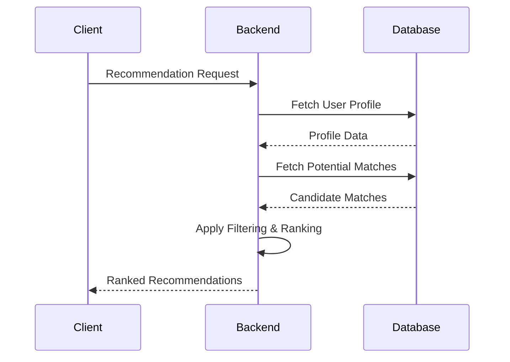
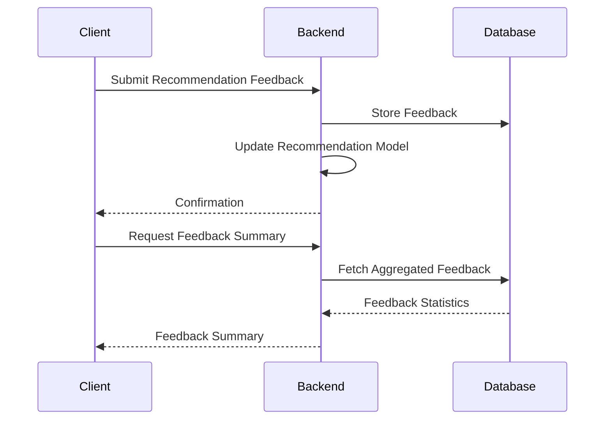
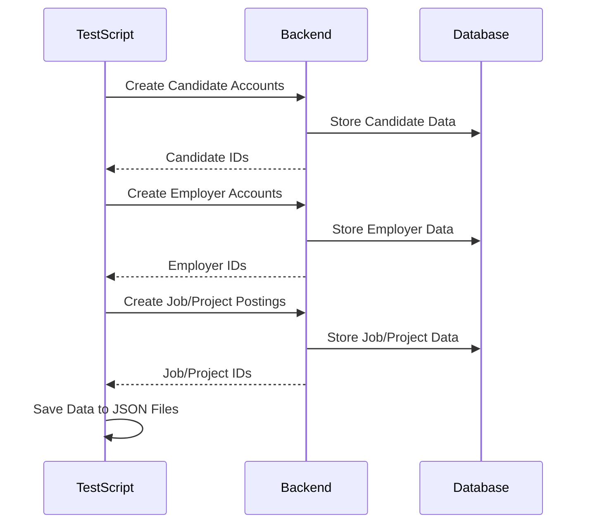

# System Patterns

## Architecture Overview

The Job Recommendation System follows a microservices architecture with the following components:

1. **FastAPI Backend**: RESTful API endpoints for all functionality
2. **Streamlit Frontend**: User interface for interacting with the system
3. **MongoDB Database**: Data storage for profiles, jobs, and recommendations
4. **Ollama Embedding Service**: Vector embedding generation for semantic matching
5. **Testing Framework**: Comprehensive testing tools for verification

## Component Relationships

## Key Design Patterns

### API Design Patterns
- RESTful endpoint structure
- JWT authentication for security
- Pydantic models for request/response validation
- Consistent error handling
- Versioned endpoints where needed
- Comprehensive documentation

### Data Access Patterns
- Repository pattern for database access
- Data Transfer Objects (DTOs) for API responses
- Vector embeddings for semantic search
- Indexing for performance optimization

### Recommendation Patterns
- Vector similarity for matching
- Hybrid filtering approach
- Feedback-based improvement
- Confidence scoring
- Match factor analysis

### Testing Patterns
- Unit tests for core functionality
- Integration tests for API endpoints
- Visual demonstration for workflow verification
- Demo data generation for realistic testing
- Comprehensive test reporting

## Core System Flows

### Authentication Flow

### Recommendation Flow

### Feedback Collection Flow

### Demo Data Generation Flow

## Module Structure

### Backend Modules
- **auth**: Authentication and authorization
- **models**: Data models and schemas
- **routes**: API endpoints
- **services**: Business logic
- **utils**: Utility functions
- **db**: Database access
- **ml**: Machine learning components

### Frontend Modules
- **pages**: Multi-page application structure
- **components**: Reusable UI components
- **utils**: Frontend utility functions
- **api**: API client functions

### Testing Modules
- **tests**: Test scripts and utilities
- **workflow_functions**: Helper functions for workflow testing
- **test_suite**: Organized test cases
- **demo_data**: Demo data generation scripts

## Data Models

### User Model
- Basic information (name, email, etc.)
- Authentication details
- Profile type (candidate/employer)
- Preferences and settings

### Candidate Profile
- Skills with proficiency levels
- Work experience
- Education history
- Availability
- Remote work preferences
- Career goals

### Employer Profile
- Company information
- Industry
- Size
- Location
- Contact details

### Job Posting
- Requirements
- Responsibilities
- Compensation
- Location
- Remote work options
- Skills needed

### Project Posting
- Requirements
- Duration
- Budget
- Skills needed
- Availability requirements

### Recommendation
- Match score
- Match factors
- Relevance metrics
- Action tracking

### Feedback
- Recommendation ID
- User ID
- Relevance score
- Accuracy score
- Action taken
- Comments

## Testing Patterns

### API Testing
- Endpoint validation
- Authentication verification
- Response format checking
- Error handling validation
- Performance measurement

### Visual Demonstration
- Workflow verification
- UI interaction testing
- End-to-end process validation
- Screenshot capture

### Demo Data Generation
- Realistic profile creation
- Varied data characteristics
- Edge case coverage
- Volume testing
- Data persistence

### Test Reporting
- Success/failure tracking
- Performance metrics
- Coverage analysis
- Issue identification

## System Interactions

### User Registration
1. User submits registration form
2. System validates input
3. System creates user account
4. System generates authentication token
5. User receives confirmation

### Profile Creation
1. User submits profile information
2. System validates input
3. System creates profile
4. System generates embeddings
5. Profile is ready for matching

### Job Posting
1. Employer creates job posting
2. System validates input
3. System creates job posting
4. System generates embeddings
5. Job is ready for matching

### Recommendation Generation
1. User requests recommendations
2. System retrieves user profile
3. System finds potential matches
4. System applies filters and ranking
5. System returns ranked recommendations

### Feedback Collection
1. User provides feedback on recommendation
2. System stores feedback
3. System updates recommendation model
4. Future recommendations are improved

### Demo Data Creation
1. Test script generates realistic user data
2. System creates accounts through API
3. Test script generates job/project data
4. System creates postings through API
5. Test data is saved for reference

## Design Decisions

### Authentication
- JWT tokens for stateless authentication
- Refresh token mechanism for extended sessions
- Role-based access control

### Database
- MongoDB for flexible schema
- Indexes for query optimization
- Vector storage for embeddings

### API
- RESTful design for clarity
- Comprehensive documentation
- Consistent response format
- Detailed error messages

### Testing
- Comprehensive test coverage
- Visual demonstration for workflow verification
- Demo data generation for realistic testing
- Automated test execution

## Patterns for Extension

### Adding New Recommendation Types
1. Create new endpoint in recommendation routes
2. Implement matching algorithm in service layer
3. Add frontend component for display
4. Create test cases for validation

### Adding New Profile Fields
1. Update user model schema
2. Add migration for existing data
3. Update profile forms in frontend
4. Update matching algorithms if needed

### Adding New Testing Capabilities
1. Create new test script in tests directory
2. Implement test cases and assertions
3. Add to test suite for automated execution
4. Document testing approach

### Adding New Demo Data Types
1. Create new generation script
2. Define realistic data patterns
3. Implement API calls for data creation
4. Add JSON storage for reference

## Notes
- Maintain separation of concerns
- Follow RESTful API design principles
- Ensure comprehensive testing
- Document all endpoints and models
- Focus on modular, extensible design
- Prioritize performance for vector operations
- Consider scalability in database design
- Implement proper error handling
- Provide detailed feedback on matches
- Use realistic demo data for testing 